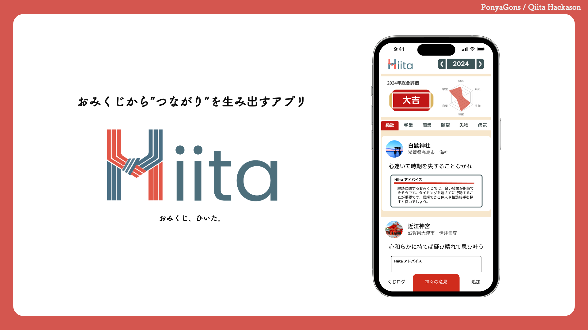

# Hiita

## プロダクト概要
### おみくじ × つながり
#### 『おみくじから生活に活用しよう』

引いたおみくじをもっと活用するためのアプリケーション。
おみくじをあなたの生活にプラグイン。

### 背景・課題
初詣をはじめ、様々な祈願、そして旅行など、神社仏閣に参拝する機会は意外と多い。
また参拝の記念として、その時の機運を占うおみくじを引くことも同じく多いではないだろうか。

通常、おみくじは引いたその場で吉凶や運勢を読み、「縁を結ぶ」や「悪運を結んで絶つ」という意味を込め、その場に納めることが多いと思われる。
ただし納めてしまうことにより、運勢やお告げを後から再度確認することが不可能となってしまい、その場限りのイベントとなってしまう。

我々は、その場限りとなりがちな「おみくじ」を記録しわかりやすく提示することで、普段の生活につなげることができるのではないかと考え、このプロダクトを作成した。

また、おみくじに記載されている運勢に対し、神社仏閣情報といった情報を組み合わせ、独自のアドバイスを出力することでユーザに新しいおみくじの体験を提供できると考えている。

なお、プロダクト名である「Hiita」は、「おみくじを **引いた** 後」に使用するアプリであることから命名した。

### プロダクト説明
ユーザは「Hiita」アプリケーションを通じて、以下の機能を使用することができる。

#### おみくじの結果を記録
アプリからおみくじの写真を送信することで、OCR機能によりおみくじの結果をテキストデータとしてアプリに保存することができる。

#### 過去に引いたおみくじの一覧を閲覧
アプリでは、過去に引いたおみくじの吉凶や運勢を一覧で確認することができる。
過去に引いたおみくじから、どのように運勢が変化してきているのかを簡単に知ることが可能である。

#### 特定の運勢を神社仏閣ごとに閲覧
「縁談」や「学業」など、個別の運勢がどのように変化しているのかもアプリから確認することが可能である。
本機能では、ChatGPTと神社仏閣データを組み合わせることで、独自のアドバイスを受けることができる。

### 特長

#### 1. おみくじの写真を撮るだけで、吉凶や運勢情報を簡単記録
サーバサイドでOCR機能を用い、自動で吉凶や運勢といった情報をテキストデータへ変換・保存。
写真のみで記録する場合と比較し読みやすく、過去データとも比較しやすくなる。

#### 2. 運勢情報を分析し、あなたの運勢をグラフ表示で視覚的に表示
ユーザが特に気にしている運営を6つ選択することで、おみくじの運勢情報を分析しグラフ表示することが可能。
特にどの運勢が良い・悪いのかを一目で確認することができるようになる。

#### 3. おみくじの結果について、さらにアプリからアドバイス！
ChatGPTと独自の神社仏閣情報を組み合わせることで、おみくじの結果からどのように行動すべきかをアドバイス。
おみくじの良いとこどりが可能に。

### 解決出来ること
これまでのおみくじでは、その場で納めることで1つのイベントとして完結していた。
また、くじを持ち帰る場合でも1年を目安に納めるのが通例となっており、複数年にわたって記録・保持されるものではなかった。
Hiitaでは、おみくじを簡単に記録し後から簡単に振り返ることが可能なプロダクトとしたことで、複数年の自身の運勢を通して振り返ることが可能となる。
例えば、吉凶で「凶」を引きその場で納めたとしても、数ヶ月後にお告げや運勢を再確認することが可能となり、その時より自身がどのように生活したかを振り返えることができる。

このように本アプリを通じて、今までおみくじを吉凶のみ確認していた人も、記録をしていなかった人も、もっとおみくじのお告げを活用して生活につなげることができるだろう。

### 今後の展望
おみくじ自体の記載フォーマットが多数あり、種類によりきれいに読み取れないことも多い。今後の展望として精度をあげていきたいと考えている。
また、想像以上に機能が多くなってしまったため、実装が間に合わないところも多かった。

## 使用技術
### フロントエンド
* Vue.js

### サーバサイド
* kotlin
* Spring Boot

### OCRモデル

### 生成AIモデル
* OpenAI GPT3 TURBO
